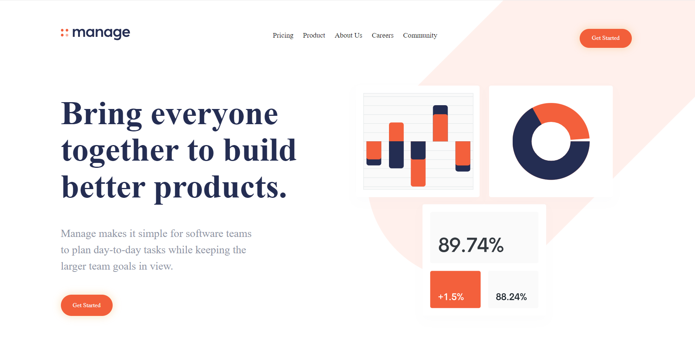

# Frontend Mentor - Manage landing page

## Welcome! 👋

Thanks for checking out this front-end coding challenge.

[Frontend Mentor](https://www.frontendmentor.io) challenges help you improve your coding skills by building realistic projects.

**To do this challenge, you need a basic understanding of HTML, CSS and JavaScript.**

## The challenge

The websites that I used to changue the color in my images's footer like twitter, facebook
- [Filter in css](https://codepen.io/sosuke/pen/Pjoqqp)

## Slider
The website that I used to create a slider of comments in my section is:
- [Slider](https://swiperjs.com/)

## My page 
